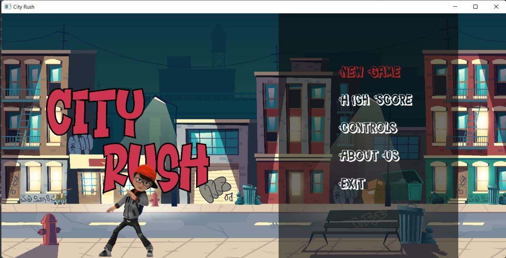
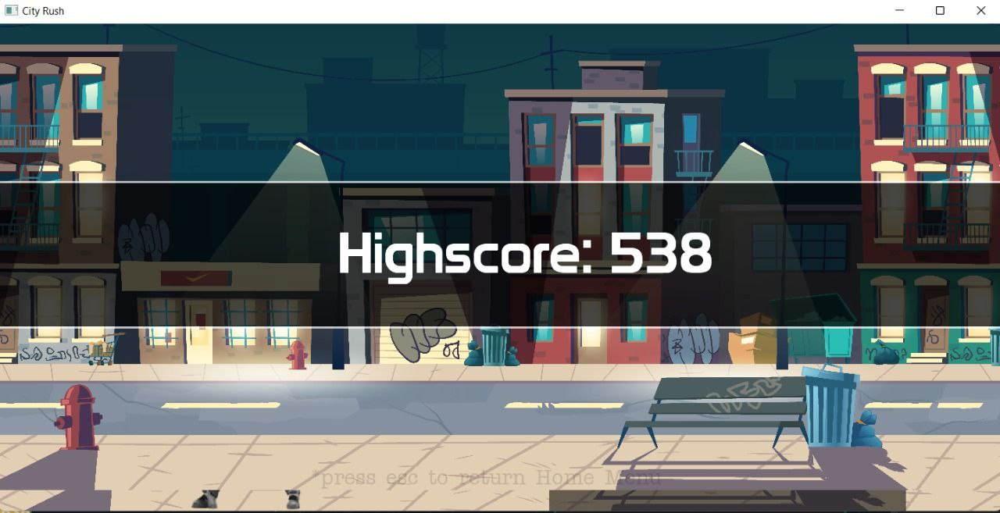
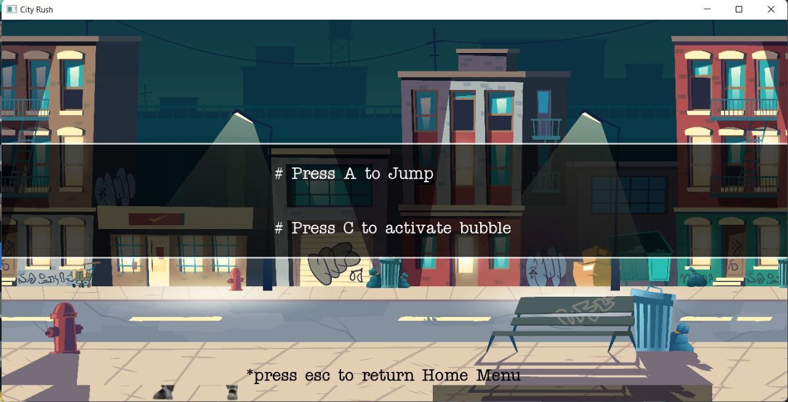
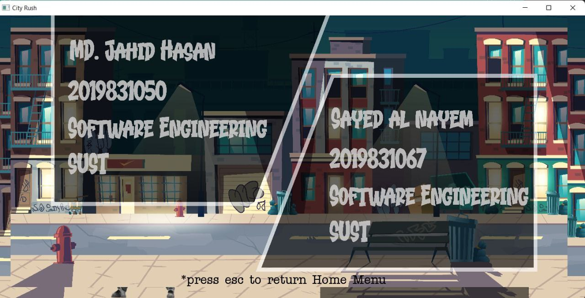

# City Rush

City Rush is a cross-platform Java game developed using the libGDX game development framework based on OpenGL (ES). The game features high-quality textures created with the help of Texture Packer.

## Game Overview

City Rush is an exciting running game which was mainly inspired by the excitement of urban adventure where players dash through a lively cityscape, avoiding obstacles and gathering points to achieve the highest scores. The game pushes players to beat previous records and reach new milestones, offering a dynamic and engaging experience with every run. 

## Implementations

- **libGDX**: Utilized for game development.
- **High-quality Textures**: Created using Texture Packer.
- **Background**: Created amazing urban background using Adobe Illustrator
- **Engaging Gameplay**: Simple yet challenging gameplay that keeps players hooked.

## Controls

## About Us

